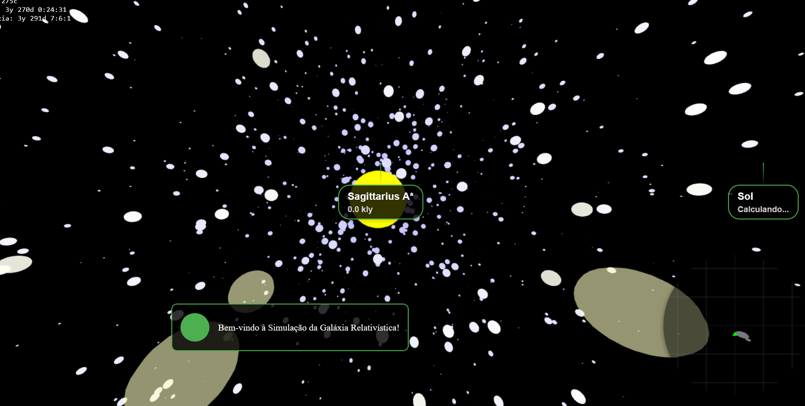

# Simulador de Galáxia Relativística

Uma simulação interativa da Via Láctea que demonstra os efeitos da Relatividade Especial, incluindo dilatação do tempo, contração do comprimento e efeito Doppler relativístico.

🚀 **[Experimente a simulação aqui!](https://ulisses177.github.io/Galaxia-Relatividade-Especial/)**

## Características

- 🌌 Simulação realista da Via Láctea com braços espirais
- ⚡ Efeitos relativísticos em tempo real
- 🎯 Sistema de navegação com autopilot
- 📱 Interface responsiva (desktop e mobile)
- 🕹️ Controles intuitivos
- 🗺️ Minimapa interativo
- 🌟 Pontos de interesse (incluindo Sagittarius A*)

## Como Usar

1. Use as teclas WASD para movimento frontal/lateral
2. Setas para movimento vertical
3. Mouse/Touch para olhar ao redor
4. Toque/Hover no minimapa para expandir
5. Clique em pontos no minimapa para ativar autopilot
6. Observe os efeitos relativísticos conforme sua velocidade aumenta!

## Efeitos Relativísticos Simulados

- Dilatação do tempo (γ)
- Contração do comprimento
- Efeito Doppler relativístico (mudança de cor das estrelas)
- Aberração relativística

## Tecnologias Utilizadas

- Three.js para renderização 3D
- JavaScript puro para física relativística
- CSS para interface responsiva
- HTML5 Canvas para minimapa

## Próximas Atualizações

- [ ] Mais pontos de interesse
- [ ] Melhorias no sistema de autopilot
- [ ] Efeitos visuais aprimorados
- [ ] Tutorial interativo
- [ ] Modo de foto/captura de tela
- [ ] Estatísticas de viagem

## Contribuindo

Contribuições são bem-vindas! Sinta-se à vontade para abrir issues ou enviar pull requests.

## Licença

Este projeto está licenciado sob a MIT License - veja o arquivo [LICENSE](LICENSE) para detalhes.

## Créditos

Desenvolvido por Ulisses Brandão como parte de um projeto para demonstrar conceitos de Relatividade Especial de forma interativa e educativa.

## Links

- [Simulação Online](https://ulisses177.github.io/Galaxia-Relatividade-Especial/)
- [Repositório GitHub](https://github.com/ulisses177/Galaxia-Relatividade-Especial)
